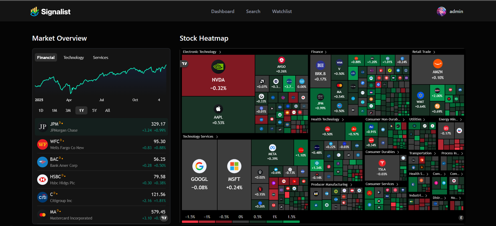

<div align="center">
  <br />
  
  <br />

  <div>
    
    
    
    
    <br/>
    
    
    
  </div>

  <h3 align="center">Stock Market App — Alerts, Charts, AI Insights</h3>
</div>

## 📋 <a name="table">Table of Contents</a>

1. ✨ [Introduction](#introduction)
2. ⚙️ [Tech Stack](#tech-stack)
3. 🔋 [Features](#features)
4. 🤸 [Quick Start](#quick-start)
5. 🚀 [Deployment](#deployment)

## <a name="introduction">✨ Introduction</a>

AI-powered modern stock market app built with Next.js, Shadcn, Better Auth, and Inngest! Track real-time prices, explore company insights, and manage personalized watchlists. Event-driven workflows power AI-driven daily news digests and personalized welcome emails, helping users stay informed with the latest market trends.

## <a name="tech-stack">⚙️ Tech Stack</a>

- **[Better Auth](https://www.better-auth.com/)** is a framework-agnostic authentication and authorization library for TypeScript. It provides built-in support for email/password login, social sign-on (Google, GitHub, Apple, and more), and multi-factor authentication, simplifying user authentication and account management.


- **[Finnhub](https://finnhub.io/)** is a real-time financial data API that provides stock, forex, and cryptocurrency market data. It offers developers access to fundamental data, economic indicators, and news, making it useful for building trading apps, dashboards, and financial analysis tools.

- **[Inngest](https://www.inngest.com/)** is a platform for event-driven workflows and background jobs. It allows developers to build reliable, scalable automated processes such as real-time alerts, notifications, and AI-powered workflows.

- **[MongoDB](https://www.mongodb.com/)** is a flexible, high-performance NoSQL database. It stores data in JSON-like documents, supports dynamic schemas, and provides robust features for scalability, replication, and querying.

- **[Nodemailer](https://nodemailer.com/)** is a Node.js library for sending emails easily. It supports various transport methods such as SMTP, OAuth2, and third-party services, making it a reliable tool for handling transactional emails, notifications, and contact forms in applications.

- **[Next.js](https://nextjs.org/docs)** is a powerful React framework for building full-stack web applications. It provides server-side rendering, static site generation, and API routes, allowing developers to create optimized and scalable apps quickly.

- **[Shadcn](https://ui.shadcn.com/docs)** is an open-source library of fully customizable, accessible React components. It helps teams rapidly build consistent, visually appealing UIs while allowing full control over design and layout.

- **[TailwindCSS](https://tailwindcss.com/)** is a utility-first CSS framework that allows developers to build custom, responsive designs quickly without leaving their HTML. It provides pre-defined classes for layout, typography, colors, and more.

- **[TypeScript](https://www.typescriptlang.org/)** is a statically typed superset of JavaScript that improves code quality, tooling, and error detection. It is ideal for building large-scale applications and enhances maintainability.

## <a name="features">🔋 Features</a>

👉 **Stock Dashboard**: Track real-time stock prices with interactive line and candlestick charts, including historical data, and filter stocks by industry, performance, or market cap.

👉 **Powerful Search**: Quickly find the best stocks with an intelligent search system that helps you navigate through the market.

👉 **Watchlist**: Create a personalized watchlist to keep track of your favorite stocks and access them easily.

👉 **Company Insights**: Explore detailed financial data such as PE ratio, EPS, revenue, recent news, filings, analyst ratings, and sentiment scores for informed decision-making.

👉 **Real-Time Workflows**: Powered by **Inngest**, automate event-driven processes like daily news delivery and personalized welcome emails.

👉 **AI-Powered Summaries**: Generate personalized daily market summaries and news digests using **Gemini AI**, helping users stay informed with the latest market trends.

👉 **Notifications**: Receive personalized welcome emails and daily news summaries directly to your inbox.

## <a name="quick-start">🤸 Quick Start</a>

Follow these steps to set up the project locally on your machine.

**Prerequisites**

Make sure you have the following installed on your machine:

- [Git](https://git-scm.com/)
- [Node.js](https://nodejs.org/en)
- [npm](https://www.npmjs.com/) (Node Package Manager)

**Cloning the Repository**

```bash
git clone https://github.com/vivans720/Signalist.git
cd Signalist
```

**Installation**

Install the project dependencies using npm:

```bash
npm install
```

**Set Up Environment Variables**

Create a new file named `.env` in the root of your project and add the following content:

```env
NODE_ENV='development'
NEXT_PUBLIC_BASE_URL=http://localhost:3000

# FINNHUB
NEXT_PUBLIC_NEXT_PUBLIC_FINNHUB_API_KEY=
FINNHUB_BASE_URL=https://finnhub.io/api/v1

# MONGODB
MONGODB_URI=

# BETTER AUTH
BETTER_AUTH_SECRET=
BETTER_AUTH_URL=http://localhost:3000

# GEMINI
GEMINI_API_KEY=

#NODEMAILER
NODEMAILER_EMAIL=
NODEMAILER_PASSWORD=
```

Replace the placeholder values with your real credentials. You can get these by signing up at: [**MongoDB**](https://www.mongodb.com/products/platform/atlas-database), [**Gemini**](https://aistudio.google.com/prompts/new_chat?utm_source=chatgpt.com), [**Inngest**](https://www.inngest.com/), [**Finnhub**](https://finnhub.io).

**Running the Project**

```bash
npm run dev
npx inngest-cli@latest dev
```

Open [http://localhost:3000](http://localhost:3000) in your browser to view the project.

## <a name="deployment">🚀 Deployment</a>

The easiest way to deploy this app is using [Vercel](https://vercel.com/):

1. Push your code to a GitHub repository.
2. Import the project into Vercel.
3. Add your **Environment Variables** in the Vercel dashboard.
4. Click **Deploy**.